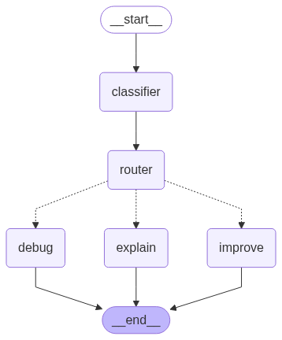

# LangGraph Multi-Agent for Coding Assistance

[](https://colab.research.google.com/github/mfehr7/coding-multiagent/blob/main/coding_multiagent.ipynb)
[](https://www.python.org/downloads/)
[](https://opensource.org/licenses/MIT)

## Overview

This project is a multi-agent system built using LangGraph that acts as your personal coding assistant by explaining, improving, or debugging code. I built this to gain more hands-on experience with AI Agents from a broader sense, but also to test the capabilities of the LangGraph framework in creating multi-agent systems to solve complex problems.

## How It Works

The system is designed as a graph (hence the name LangGraph). The workflow is as follows:

1.  **Classifier Agent:** Receives the initial user query, identifies the code and error message, and classifies the user's intent to one of three categories: debug, explain, or improve.
2.  **Router (Conditional Edge):** Dynamically directs the graph's workflow to one of the below agents based off the classifier's decision.
3.  **Debug Agent:** Examines the user-provided code and error traceback. Then, explains the underlying issue and provides a corrected code snippet.
4.  **Explain Agent:** Analyzes the code snippet to deliver a comprehensive line by line explanation so that the user can better understand and learn its structure.
5.  **Improve Agent:** Reviews the current code, learns its structure, and suggests ways to improve the code's efficiency and readabiliy. Also provides an updated code snippet.





## Technologies Used

* **Language:** Python
* **Core Framework:** LangGraph
* **LLM:** Anthropic's Claude 3 Haiku
* **Environment:** Google Colab

## Getting Started

To run this project, you will need an API key to use the notebook. I used the [Anthropic API](https://console.anthropic.com/settings/keys) and would highly recommend, since it works great for this task and easily integrates structured outputs with its LLMs. If you choose to use a different provider, make sure that the model you are using supports the `llm.with_structured_output()` method.

You can run this project in two ways:

### Option 1: Run in Google Colab

This is the easiest way to get started.

1.  **Click the Badge:** Click the "Open in Colab" badge at the top of this README.
2.  **Add API Keys:** The notebook requires an API key to function (see above). Use Colab's Secrets Manager to store them securely:
    * Click the **key icon (🔑)** in the left-hand sidebar.
    * Add a new secret for your API key (e.g., `ANTHROPIC_API_KEY`).
    * Make sure the "Notebook access" toggle is enabled for that secret.
3.  **Run the Notebook:** Execute the cells in order from top to bottom. The first code cell will install all necessary dependencies for you. If you used a different LLM provider, you will need to install the corresponding LangGraph package.

### Option 2: Run Locally

If you prefer to run the project on your own machine, follow these steps.

1.  **Prerequisites:**
    * Python 3.10 or higher
    * Git
    * JupyterLab

2.  **Clone the Repository:**
    ```bash
    git clone https://github.com/mfehr7/coding-multiagent.git
    cd coding-multiagent
    ```

3.  **Create a Virtual Environment:**
    * **Windows:** `python -m venv venv` and `.\venv\Scripts\activate`
    * **macOS/Linux:** `python3 -m venv venv` and `source venv/bin/activate`

4.  **Install Dependencies:**
    ```bash
    pip install -r requirements.txt
    ```

5.  **Set Up Environment Variables:**
    * Create a `.env` file in the project's root directory and add your API key.

6.  **Launch JupyterLab**
    * In your terminal (with the virtual environment active), run the following command:

    ```bash
    jupyter lab
    ```

    This will start the JupyterLab server and should automatically open a new tab in your web browser. If it doesn't, your terminal will provide a URL (usually `http://localhost:8888/...`) that you can copy and paste into your browser.

7.  **Run the Notebook**

    * From the file browser in JupyterLab, click on your notebook file (`coding_multiagent.ipynb`).
    * Once the notebook is open, run the cells in order from top to bottom.
